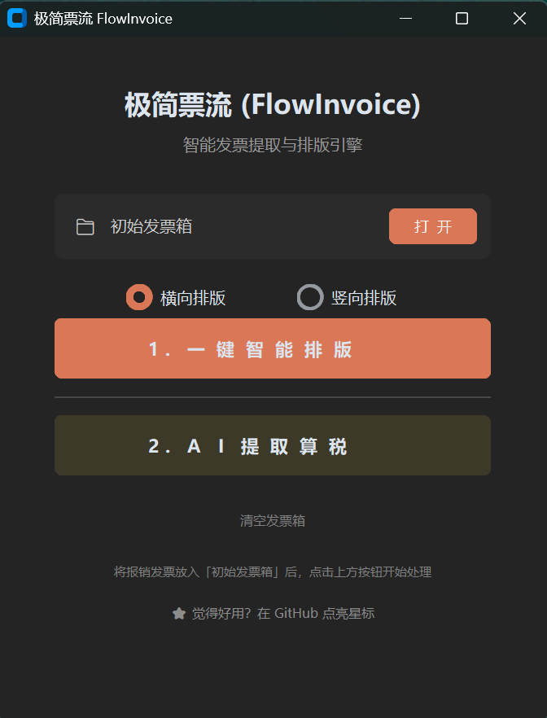
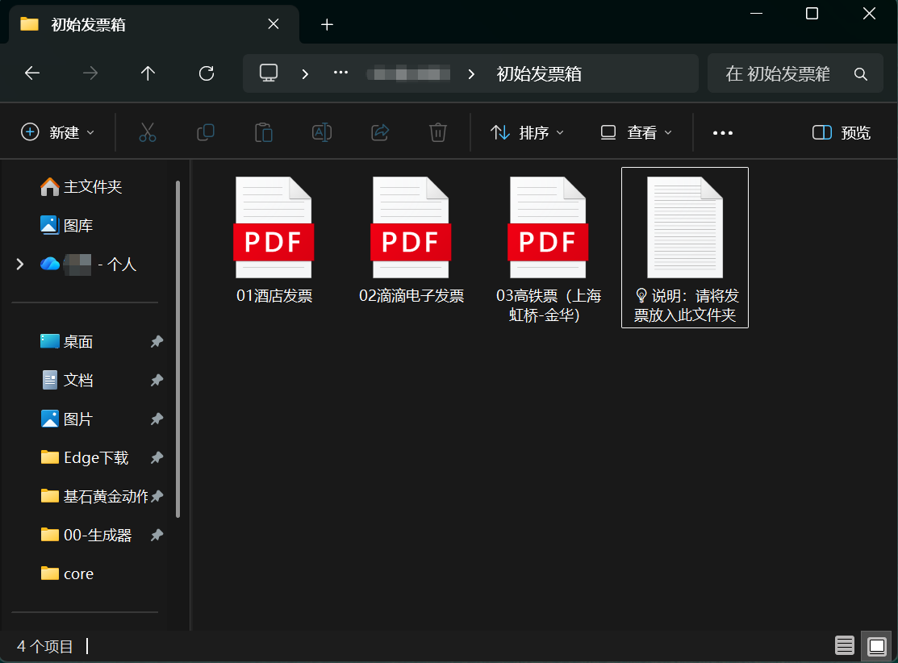
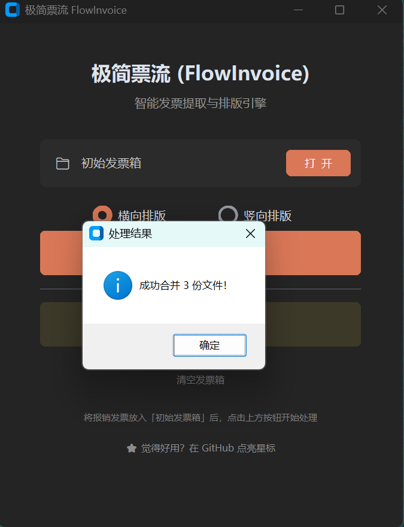
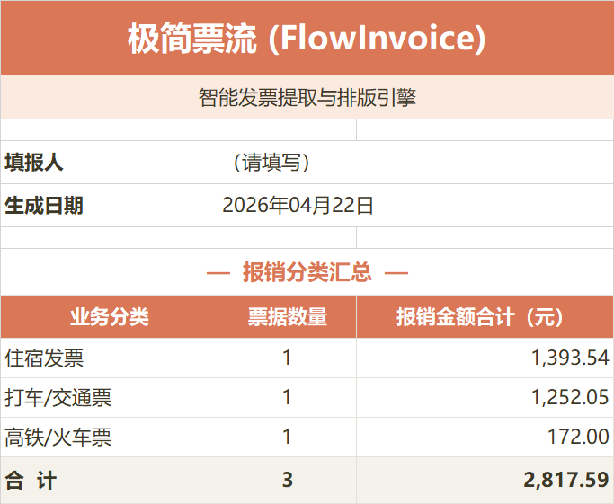
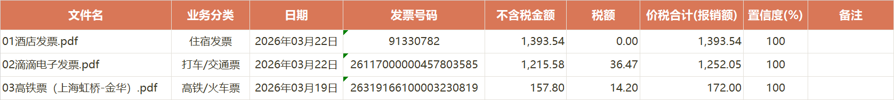
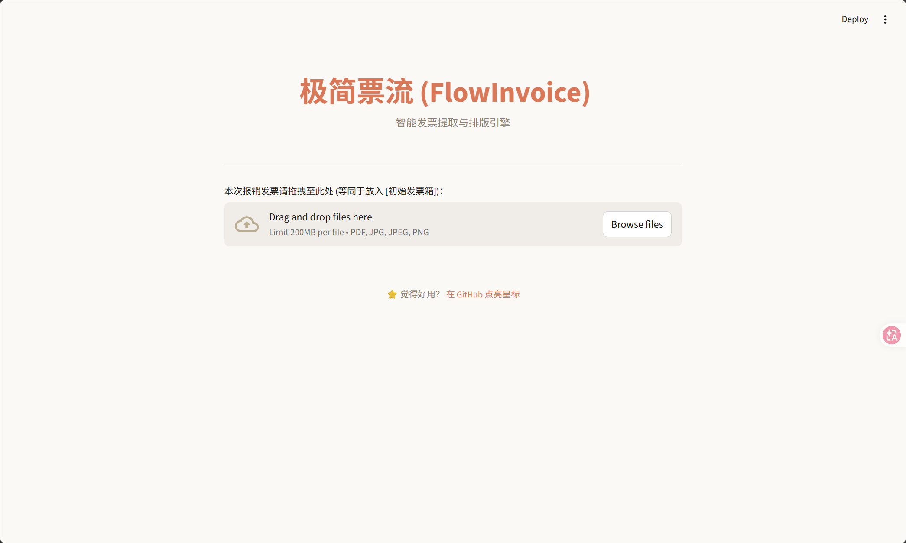
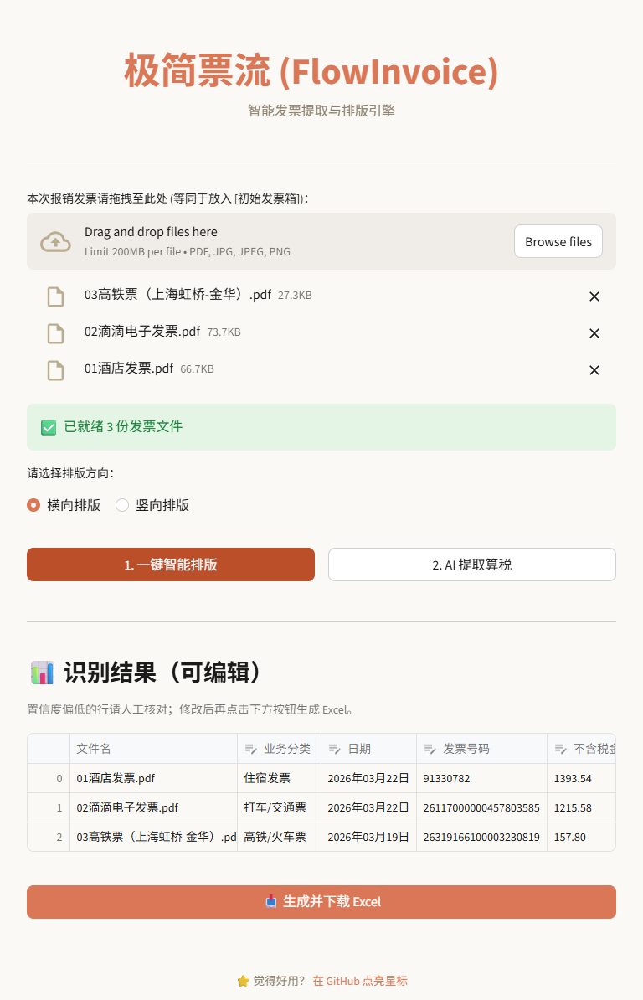

# 🧾 极简票流 FlowInvoice 使用手册

> 本手册面向**完全不懂技术**的读者。照做每一步，5 分钟内你就能完成第一次发票整理。

---

## 📋 目录

- [0. 5 秒看懂这是什么](#0-5-秒看懂这是什么)
- [1. 下载与安装](#1-下载与安装)
- [2. 场景 A：单次差旅报销](#2-场景-a单次差旅报销)
- [3. 场景 B：月度批量整理](#3-场景-b月度批量整理)
- [4. 场景 C：只要合并打印不要算税](#4-场景-c只要合并打印不要算税)
- [5. Excel 怎么看](#5-excel-怎么看)
- [6. 网页端什么时候用](#6-网页端什么时候用)
- [7. 常见问题](#7-常见问题)
- [8. 找我反馈](#8-找我反馈)

---

## 0. 5 秒看懂这是什么

**极简票流** 解决两件烦人的事：

1. **把一堆零散的发票（PDF / 手机拍照 / 扫描件）自动居中排版拼到 A4 纸上**，不用你手动调一晚上
2. **自动读出每张票的金额、日期、号码，算好税额，生成 Excel**，不用你拿计算器一张张敲

所有处理**在你自己电脑上完成**，不会上传到任何云服务器，发票隐私 0 泄露。

---

## 1. 下载与安装

### 👤 如果你不懂技术（推荐路径）

1. 浏览器打开 https://github.com/VicLuoV5/FlowInvoice/releases
2. 找到最新版（一般排最上面），展开 `Assets`
3. 点击 `FlowInvoice.exe` 下载（约 180 MB）
4. 下载完**双击直接运行**，无需安装任何东西

> 💡 **首次打开较慢**：Windows 需要 3-8 秒解压程序，属正常现象，别以为死机了。

### 🧑‍💻 如果你是开发者

```bash
git clone https://github.com/VicLuoV5/FlowInvoice.git
cd FlowInvoice
pip install -r requirements.txt
python app.py          # 启动桌面端
streamlit run web_app.py  # 启动网页端
```

---

## 2. 场景 A：单次差旅报销

> **典型情境**：你上周出差 3 天，攒了机票 / 高铁票 / 打车票 / 酒店票 / 吃饭发票，现在要合并打印 + 填报销明细表交财务。

### 第 1 步：启动程序

双击 `FlowInvoice.exe`，出现这个主界面：



### 第 2 步：把发票放进"初始发票箱"

1. 点击界面上的 **「打 开」** 橙色按钮，Windows 资源管理器会弹出 `初始发票箱` 文件夹
2. 把你所有的发票文件（PDF、手机拍的 JPG、扫描的 PNG 都行）**拖到这个文件夹里**



> 💡 **如何控制发票顺序？** 把文件名前面加上编号。比如 `01_机票.pdf`、`02_高铁票.pdf`、`03_酒店.pdf`，程序会按这个编号顺序合并。

### 第 3 步：一键合并排版

1. 回到主界面，选择 **「横向排版」** 或 **「竖向排版」**
   - **横向** = A4 横着放，适合发票本身比较宽（如机票、酒店行）
   - **竖向** = A4 竖着放，适合打车票、电子发票等
   - **不确定就选横向**，兼容性最好
2. 点击橙色的 **「1. 一键智能排版」** 按钮
3. 按钮上会实时显示进度 `⏳ 排版 3/10  文件名`
4. 几秒钟后弹出成功提示：



5. 去 `00-生成器` 文件夹里找到 `合并后_报销单(横向).pdf` — 这就是你要**打印**的报销单，所有发票已居中排版好

### 第 4 步：AI 提取算税生成 Excel

1. 回到主界面，点击深褐色的 **「2. AI 提取算税」** 按钮
2. 按钮显示 `⏳ 识别 3/10 文件名`，OCR 引擎正在读取每张发票
3. 完成后弹出提示，告诉你成功提取了 N 张票据
4. 去 `00-生成器` 文件夹里找到 `发票报销明细汇总.xlsx` — 这就是你要**交给财务**的明细表

### 第 5 步：完成！

- 打印 `合并后_报销单(横向).pdf` → 粘贴纸质发票时的顺序依据
- 把 `发票报销明细汇总.xlsx` 发给财务 → 含封面汇总 + 每张票详细明细
- 点击 **「清空发票箱」** 清理文件，准备下一次报销

---

## 3. 场景 B：月度批量整理

> **典型情境**：你是自由职业者 / 个体户 / 小微企业主，每月要汇总所有发票做账。

**流程和场景 A 一样**，但有几个月度使用的技巧：

### 技巧 1：按日期给文件命名

```
20260301_滴滴.pdf
20260303_高铁上海虹桥-金华.pdf
20260305_酒店维也纳.pdf
20260308_午餐.jpg
```

这样文件名自动按日期排序，合并后的 PDF 顺序 = 时间顺序，一眼能对账。

### 技巧 2：Excel 封面可直接做交接单

生成的 Excel 第一页是按类型汇总的表格：



打印这一页 → 你和会计的交接单（总金额一目了然）。

### 技巧 3：发现异常立即核对

打开 Excel 第二页 `报销明细`，看带**颜色**的行：
- 🟥 **红色行** = 置信度 < 50%，OCR 可能识别错了，建议立即人工看原票核对
- 🟨 **黄色行** = 置信度 50-79%，建议抽查一下金额
- ⬜ **白色行** = 高置信度，正常不用管

---

## 4. 场景 C：只要合并打印不要算税

> **典型情境**：财务系统会自动导入发票数据，你只需要一张打印稿做凭证附件。

**更简单，只用 3 步：**

1. 发票拖进 `初始发票箱`
2. 点 **「1. 一键智能排版」**
3. 打印生成的合并 PDF

**完全不用**点「2. AI 提取算税」。

---

## 5. Excel 怎么看

### 第 1 页：封面汇总


这一页告诉你：
- **填报人**（显示"请填写" → 你自己手动填上名字）
- **生成日期**（自动填今天）
- **按类型汇总的金额**：机票 X 元、高铁 X 元、打车 X 元...
- **合计行**：所有发票总数 + 总金额

### 第 2 页：报销明细



每一行一张发票，9 列信息：

| 列 | 含义 |
|---|---|
| 文件名 | 对应"初始发票箱"里的原始文件 |
| 业务分类 | 机票/高铁/打车/加油/通讯/餐饮/住宿/增值税 |
| 日期 | 发票开具日 |
| 发票号码 | 8-24 位数字 |
| 不含税金额 | 价税分离后的净额 |
| 税额 | 可抵扣税额（餐饮为 0） |
| 价税合计(报销额) | **你实际报销的金额** |
| 置信度(%) | OCR 识别把握，越高越可信 |
| 备注 | `⚠️ 疑似重复`、`餐饮税额不可抵扣` 等提示 |

### 颜色规则

- 🟥 红色底 = 置信度 < 50%，**必须人工核对**
- 🟨 黄色底 = 置信度 50-79%，**建议抽查**
- ⬜ 白色底 = 高可信，一般无需干预

---

## 6. 网页端什么时候用

桌面端适合**快速批处理**，网页端适合**精细编辑**。

### 什么时候用网页端

- 你的发票有模糊 / 缺角 / OCR 可能识别错，想**在生成 Excel 之前就手动修正**
- 你想**删掉几行不想报销的票**再导出
- 你在 Mac / Linux 上（`.exe` 只能在 Windows 用）

### 启动网页端

在命令行（或开发环境）：

```bash
streamlit run web_app.py
```

浏览器会自动弹出：



### 使用流程

1. **拖拽发票**到上传区（或点 Browse files 选文件）
2. 选排版方向 → 点 **「1. 一键智能排版」** 下载合并 PDF
3. 点 **「2. AI 提取算税」** 进入**可编辑表格**



在这个表格里你可以：
- **直接改单元格的值**（比如 OCR 把金额看错了，点击直接改）
- 用下拉菜单**改业务分类**
- 看到 `⚠️ N 个文件未能识别` 的折叠面板时，点开看哪些文件失败了，可以对照原票手动补录
- 确认数据都对了，点底部 **「📥 生成并下载 Excel」** 得到最终报告

---

## 7. 常见问题

### Q1：我的发票完全没被识别出来

可能原因：
- 图片太模糊（手机拍照晃了）→ 重拍一张清晰的
- 不属于程序支持的类型 → 目前支持：机票、高铁、打车、加油、通讯、餐饮、住宿、增值税，**其他类型会进入失败列表**

处理：用**网页端**的可编辑表格手动补录一行。

### Q2：识别结果里金额不对

这是 OCR 的正常误差。
- **红色 / 黄色行** 就是程序告诉你"这行我拿不准"
- 去网页端打开可编辑表格，直接改单元格的数字，再生成 Excel

### Q3：餐饮发票的"税额"为什么显示 0

按国税规定，**餐饮服务增值税不可抵扣进项**。程序遵守这个规则，把价税合计原样作为报销额，税额填 0。备注列会有文字提示。

### Q4：生成 Excel 时提示"文件正被占用"

你的 Excel 文件还在 Office 里开着，占用了文件锁。关掉 Excel 后再点生成按钮即可。

### Q5：发票数据会上传到云端吗？

**不会。** 一切处理都在你本机上：
- OCR 引擎（RapidOCR）用的是本地 ONNX 模型
- PDF 解析用的是本地 PyMuPDF
- Excel 生成用的是本地 pandas
- 没有任何一步访问互联网

你可以断网运行这个程序，完全正常。

### Q6：一次最多处理多少张发票？

测试过 50 张不卡顿。再多理论上也没问题，只是等得久一些（OCR 每张约 2-5 秒）。

### Q7：怎么升级到新版本？

- 如果用 `.exe`：去 Releases 页面下载新版本替换旧的即可
- 如果用源码：`git pull` 然后 `pip install -r requirements.txt`

### Q8：发现了 Bug / 想要新功能怎么办？

去 https://github.com/VicLuoV5/FlowInvoice/issues 提一个 Issue，描述清楚就行。

---

## 8. 找我反馈

- **GitHub Issue**：https://github.com/VicLuoV5/FlowInvoice/issues
- **觉得好用请给个 Star ⭐**：https://github.com/VicLuoV5/FlowInvoice

---

*极简票流 FlowInvoice · 纯本地离线 · MIT License*
